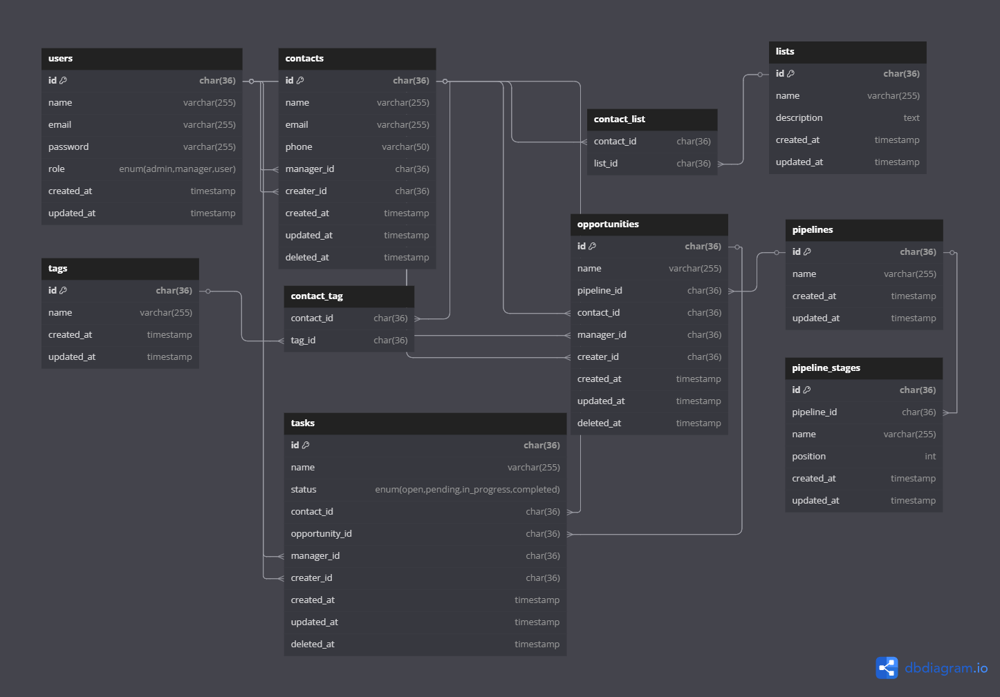

# CRM-project-test
## 1. DB Diagram:

## 2.Install

`git clone --recurse-submodules https://github.com/JesterJz/CRM-project-test.git`

`cd CRM-project-test`

`cp .env.laradock ./laradock/.env`

`cp crm.conf ./laradock/nginx/sites/`

### Edit hosts:

`windows: C:\Windows\System32\drivers\etc\hosts`

`masOS/linux: /etc/hosts`

add new line:
` 127.0.0.1      crm.local`

---
### Build and run containers:
`cd laradock`

`docker-compose up -d nginx mysql phpmyadmin elasticsearch workspace`

### Install composer and npm packages:

`docker-compose exec workspace bash && cd backend`

`composer install && npm install`

---

### Add permissions to work with the Laravel storage

`chown -R www-data:www-data /var/www && \
  chown -R www-data:www-data /var/www/backend/storage /var/www/backend/bootstrap/cache && \
  chmod -R 777 /var/www/backend/storage /var/www/backend/bootstrap/cache`

### Generate key and migrate database:

`php artisan key:generate`

`php artisan migrate --seed`